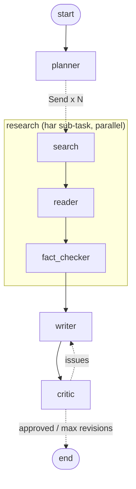

# 🔬 Multi-Agent Research Assistant

Ek question do, aur 6 AI agents milkar web se research karke **source-backed report** banate hain.
Critic agent report check karta hai aur problem milne par Writer ko wapas bhejta hai (self-correction loop).


```
                    ┌──────────── parallel, har sub-task ke liye ek branch ────────────┐
Question ─► Planner ─┤  Search ─► Reader ─► Fact-checker   (sub-task 1)                 ├─► Writer ─► Critic ─► Report
                    │  Search ─► Reader ─► Fact-checker   (sub-task 2)                 │     ▲          │
                    │  ...                                                              │     └── issues ┘
                    └───────────────────────────────────────────────────────────────────┘   (max MAX_REVISIONS)
```

## Har agent ka kaam

| Agent | File | Kya karta hai |
|---|---|---|
| **Planner** | `app/agents/planner.py` | Question ko max `MAX_SUBTASKS` chhote sub-tasks mein todta hai |
| **Search** | `app/agents/researchers.py` | Tavily / SerpAPI / DuckDuckGo se har sub-task ke links + poora page text laata hai |
| **Reader** | `app/agents/researchers.py` | Pages padhkar facts nikaalta hai, har fact ke saath uska source |
| **Fact-checker** | `app/agents/researchers.py` | Same claims ko group karta hai; claim **verified** tabhi jab `MIN_SOURCES_FOR_VERIFIED` (default 2) **alag websites** mein mile (ek site ke 2 pages = 1 source). Alag-alag numbers wale claims merge nahi hote, taaki conflict dikhe |
| **Writer** | `app/agents/writer.py` | Markdown report likhta hai: Summary, theme-wise sections, Gaps. Har fact ke aage `[S3]` jaisi source id; single-source facts "(single source)" mark hote hain |
| **Critic** | `app/agents/critic.py` | Do layer: (1) code checks: galat source id, data wali line bina citation; (2) LLM review: missing sub-task, single-source ko pakka batana, notes se contradiction, chhupaaya hua conflict. Fail hua toh feedback ke saath Writer ko wapas |

Parallelism LangGraph ke `Send` API se hai (`app/graph.py`): har sub-task ka Search → Reader → Fact-checker ek alag sub-graph branch mein ek saath chalta hai (`MAX_CONCURRENCY` tak).

### Fake links kyun nahi ban sakte (citation system)

LLM ko kabhi URL dikhaya hi nahi jaata. Fact-checker ke baad code har source ko ek id deta hai (`S1`, `S2`...), Writer sirf yeh ids likhta hai, aur `app/citations.py` report render karte waqt ids ko asli clickable links `[1]`, `[2]` mein badalta hai aur end mein **sirf cited sources** ki list banata hai. Writer apna "Sources" section likhe toh hata diya jaata hai. Isliye report ka har link sach mein research mein padha gaya page hai.

### Failure handling
- Structured LLM calls galat JSON dein toh 3 baar retry.
- Ek sub-task ka search/reader fail ho toh sirf woh branch khaali jaati hai, baaki report banti hai (log mein dikhta hai).
- Planner fail ho toh poora question ek sub-task maana jaata hai. Critic ka LLM fail ho toh code checks phir bhi chalte hain.
- Critic loop `MAX_REVISIONS` ke baad ruk jaata hai; tab report "not approved" warning ke saath milti hai.

### Graph (`python -m app.graph` se generate)



## Tech stack

- **LangGraph** – agents ka flow, parallel branches, Critic loop
- **LLM** – OpenAI, Anthropic, Gemini, Groq ya local **Ollama** (`.env` mein ek line badlo)
- **Tavily** – web search (SerpAPI aur bina-key DuckDuckGo bhi supported)
- **FastAPI** – backend (`/research`, `/research/stream`)
- **Streamlit** – frontend, agents ka kaam live dikhta hai
- **Langfuse** – har agent ke LLM calls ki tracing/monitoring (optional)
- **Docker** + Render/Railway deploy config

## Project structure

```
app/
  config.py          # saari settings .env se
  llm.py             # LLM factory (openai / anthropic / gemini / groq / ollama) + rate limit + retry
  search.py          # Tavily / SerpAPI / DuckDuckGo + page text extraction
  citations.py       # [S#] ids -> real links, citation checks
  state.py           # graph state + data models
  graph.py           # LangGraph wiring
  tracing.py         # Langfuse
  api.py             # FastAPI
  cli.py             # terminal se research: python -m app.cli "question"
  agents/            # planner, researchers (search/reader/fact-checker), writer, critic
  exports/           # downloads: PDF, Word, PowerPoint, roadmap, book, CSV
ui/streamlit_app.py  # frontend
tests/               # 37 offline tests (fake LLM + fake search), koi key nahi chahiye
Dockerfile, docker-compose.yml, render.yaml
```

## Downloads: PDF, PowerPoint, Roadmap, Book...

Research poori hone ke baad UI mein **📦 Download** tab kholo. Har format ke saamne "Banao" dabao, file ban jaane par "⬇️" button se download karo.


| Format | File | Extra LLM calls |
|---|---|---|
| Report | PDF, Word (.docx), Markdown | 0 |
| Presentation | PowerPoint (.pptx), 16:9, har slide par source links | 1 ✨ |
| Roadmap (phases, steps, milestones) | PDF, Word | 1 ✨ |
| One-page summary | PDF | 1 ✨ |
| FAQ | PDF | 1 ✨ |
| Study notes + flashcards | PDF | 1 ✨ |
| Complete research book (summary + report + roadmap + FAQ + claims appendix) | PDF | 3 ✨ |
| Facts & sources | CSV (Excel mein khulta hai) | 0 |

✨ wale formats AI se naya content likhte hain, par sirf fact-checked claims se, aur har fact par `[n]` source link hota hai (Writer ki tarah yahan bhi LLM ko sirf `[S#]` ids milti hain, asli URL code lagata hai).

API se:
```bash
curl localhost:8000/export/formats
curl -X POST localhost:8000/export -H "Content-Type: application/json" \
  -d '{"format":"slides_pptx","question":"...","report":"...","claims":[...],"sources":[...]}' -o deck.pptx
```
`/research` ka response (`question`, `report`, `claims`, `sources`) seedha isme bhej sakte ho. Code: `app/exports/`.

## 1. Keys chahiye

`.env.example` ko `.env` mein copy karo aur values bharo:

```bash
cp .env.example .env
```

| Variable | Kahan se milega | Zaroori? |
|---|---|---|
| `TAVILY_API_KEY` | https://app.tavily.com (free tier hai) | Haan (ya `SERPAPI_API_KEY` + `SEARCH_PROVIDER=serpapi`, ya bina key `SEARCH_PROVIDER=duckduckgo`) |
| `OPENAI_API_KEY` **ya** `ANTHROPIC_API_KEY` | OpenAI / Anthropic console | Agar Ollama nahi use kar rahe |
| `LANGFUSE_PUBLIC_KEY`, `LANGFUSE_SECRET_KEY` | https://cloud.langfuse.com → project settings → API keys | Optional (monitoring) |

LLM choose karna:

```env
# OpenAI
LLM_PROVIDER=openai
LLM_MODEL=gpt-4o-mini

# Anthropic
LLM_PROVIDER=anthropic
LLM_MODEL=claude-sonnet-5

# Google Gemini (free tier) - key: https://aistudio.google.com/apikey
# Free tier sirf 5 calls/minute deta hai; app khud is limit mein rehta hai (LLM_RPM).
# FAST_MODE=true se ek research ~5 calls mein (30-60 sec) ho jaati hai
LLM_PROVIDER=gemini
LLM_MODEL=gemini-3.8-flash   # naam badalte rehte hain; 404 NOT_FOUND aaye toh error mein suggest kiya model daalo
GOOGLE_API_KEY=...

# Groq (free tier, bahut tez) - key: https://console.groq.com/keys
# Gemini free ka din ka quota bahut kam hai (~20 calls/day); Groq ka zyada hai.
# Groq free: 30 calls/min, 1000/day, par sirf 8000 tokens/min, isliye pages chhote rakho.
# Model naam badalte rehte hain: https://console.groq.com/docs/models
LLM_PROVIDER=groq
LLM_MODEL=openai/gpt-oss-120b
GROQ_API_KEY=...
FAST_MODE=true
PAGE_CHARS=1500
SEARCH_RESULTS_PER_TASK=3

# Local Ollama (free, koi API key nahi)
LLM_PROVIDER=ollama
LLM_MODEL=qwen2.5:7b        # pehle: ollama pull qwen2.5:7b
OLLAMA_BASE_URL=http://localhost:11434
```

> Local Ollama laptop par slow hota hai (ek research mein 10+ minute). Tez chahiye toh Gemini ya Groq ka free key lo. Ollama hi use karna ho toh `.env` mein `MAX_SUBTASKS=3`, `SEARCH_RESULTS_PER_TASK=3`, `MAX_REVISIONS=1` rakho, aur `ollama ps` se check karo ki model GPU par chal raha hai.

> Ollama ke liye aisa model lo jo tool calling / structured output support karta ho (qwen2.5, llama3.1, mistral-nemo). Chhote models mein Fact-checker aur Critic kamzor ho sakte hain.

`.env` ko kabhi git mein commit mat karna (`.gitignore` mein already hai).

## 2. Local chalana (bina Docker)

```bash
python -m venv .venv && source .venv/bin/activate
pip install -r requirements.txt

# Terminal 1: backend
uvicorn app.api:app --reload --port 8000

# Terminal 2: frontend
streamlit run ui/streamlit_app.py
```

Browser mein http://localhost:8501 kholo. API docs: http://localhost:8000/docs

Terminal se (bina UI):

```bash
python -m app.cli "India EV market size, top 5 companies aur government policies" -o report.md
```

Sirf API test karna ho:

```bash
curl -X POST localhost:8000/research -H "Content-Type: application/json" \
  -d '{"question": "India EV market size, top 5 companies aur government policies"}'
```

## 3. Docker se chalana

```bash
docker compose up --build
# UI:  http://localhost:8501
# API: http://localhost:8000/docs
```

Local LLM Docker ke andar chahiye toh:

```bash
docker compose --profile ollama up --build
docker compose exec ollama ollama pull qwen2.5:7b
# .env: LLM_PROVIDER=ollama, OLLAMA_BASE_URL=http://ollama:11434
```

**Windows shortcut:** pehli baar `docker compose up --build` ke baad, agli baar se bas `start.bat` par double-click karo (background mein chalta hai aur browser khol deta hai). Band karne ke liye `stop.bat`. Code badlo tabhi `--build` chahiye.

Ek hi image dono services chalaati hai: `SERVICE=api` (FastAPI) ya `SERVICE=ui` (Streamlit), port `PORT` env se.

## 4. Tests

```bash
pytest -q
```

Tests fake LLM aur fake search use karte hain, isliye koi key nahi chahiye. Yeh check karte hain ki:
- Planner duplicate sub-tasks hataata hai aur research branches sach mein parallel chalti hain
- Claim 2 alag websites par hi verified hota hai (ek site ke 2 pages nahi ginte), ads skip hote hain
- Critic fake source id aur bina citation wali line pakadta hai, Writer revision mein fix karta hai
- Report mein sirf asli research URLs hain, LLM ka apna Sources section hata diya jaata hai
- Ek branch ka search fail ho toh bhi report banti hai; Critic loop max revisions par rukta hai
- FastAPI stream endpoint saare 6 agents ke events aur final result bhejta hai

Development ke dauran yeh bhi check kiya gaya: OpenAI, Anthropic aur Ollama ke asli LangChain clients ke saath poora graph (mock HTTP server par), Docker image build + dono services start, aur Streamlit UI browser mein (live progress, tabs, download ke baad bhi report dikhti rehti hai).

## 5. Deploy

Code pehle GitHub repo mein push karo.

### Render (sabse aasaan)
1. Render dashboard → **New → Blueprint** → apna repo select karo. `render.yaml` se dono services (`research-api`, `research-ui`) ban jaayengi.
2. `research-api` ke Environment mein `OPENAI_API_KEY`, `TAVILY_API_KEY` (aur chaho toh Langfuse keys) daalo.
3. Deploy. UI ka URL `research-ui` service par milega. UI backend ko Render ke private network se call karta hai.

### Railway
1. New Project → **Deploy from GitHub repo** → do services banao same repo se.
2. Service 1 (api): variables `SERVICE=api` + saari keys. Settings → Networking → public domain generate karo.
3. Service 2 (ui): variables `SERVICE=ui`, `API_URL=https://<api-service-ka-domain>`. Public domain generate karo.
Railway `PORT` khud set karta hai, Dockerfile use pick kar leta hai.

### AWS (App Runner / ECS)
```bash
docker build -t research-agent .
# ECR mein push karo, phir App Runner mein do services:
#   api -> env SERVICE=api + keys, port 8000
#   ui  -> env SERVICE=ui, API_URL=<api ka URL>, port 8000 (PORT env se)
```
Keys ke liye AWS Secrets Manager use karo, image mein kabhi mat daalo.

## 6. Monitoring (Langfuse)

`LANGFUSE_PUBLIC_KEY` aur `LANGFUSE_SECRET_KEY` set karte hi har research run ek trace ban jaata hai. Langfuse dashboard mein dikhega: kaunse agent ne kya prompt bheja, kitne tokens lage, kitna time laga, aur Critic loop kitni baar chala. Keys nahi hain toh tracing chup-chaap off rehti hai.

## Settings

| Variable | Default | Matlab |
|---|---|---|
| `MAX_SUBTASKS` | 5 | Planner max kitne sub-tasks banaye |
| `SEARCH_PROVIDER` | tavily | tavily / serpapi / duckduckgo |
| `SEARCH_RESULTS_PER_TASK` | 4 | Har sub-task ke liye kitne links |
| `PAGE_CHARS` | 5000 | Har page ka kitna text Reader ko milta hai |
| `MIN_SOURCES_FOR_VERIFIED` | 2 | Claim verified hone ke liye min alag sources |
| `MAX_REVISIONS` | 2 | Critic kitni baar Writer ko wapas bhej sakta hai |
| `MAX_CONCURRENCY` | 5 | Ek saath kitni research branches |
| `OLLAMA_NUM_CTX` | 16384 | Ollama ka context size. Ollama ka apna default chhota hai, jisse lambe pages kat jaate hain |
| `FAST_MODE` | false | true = Fact-checker same-claim grouping aur Critic sirf code se (LLM nahi); ~5 LLM calls per research, max 3 sub-tasks. Free Gemini ke liye best |
| `LLM_RPM` | -1 | Max LLM calls per minute (60s window). -1 = auto (gemini: 5), 0 = no limit |
| `CORS_ORIGINS` | * | Next.js jaisa alag frontend ho toh uska URL |

### Cost / speed ka andaaza
Ek run mein LLM calls ≈ 1 (Planner) + 2 × sub-tasks (Reader, Fact-checker) + 2 × (1 + revisions) (Writer, Critic). 5 sub-tasks aur 1 revision par ~15 calls. `gpt-4o-mini` jaise sasta model kaafi hai; Writer/Critic ke liye bada model quality badhata hai.

## Aage kya add kar sakte ho (interview mein bolne layak)
- Writer aur Critic ke liye alag (bada) model, baaki agents ke liye sasta model
- Redis/Postgres checkpointer se run history aur resume
- Human-in-the-loop: Planner ke sub-tasks user se approve karwana (LangGraph `interrupt`)
- Eval set: 20 questions par citation accuracy measure karna, Langfuse datasets mein
